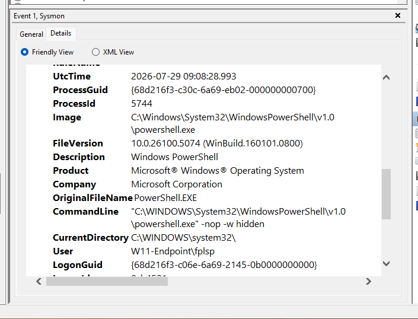
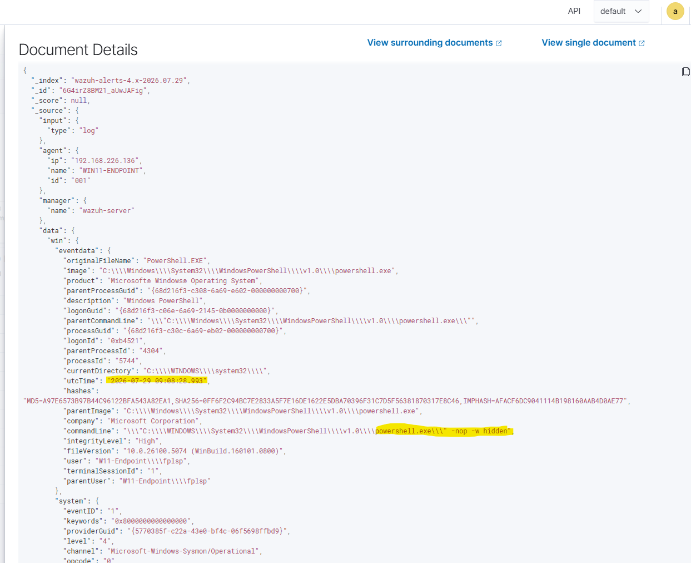

# Home-SOC
Personal security operations centre lab to simulate enterprise environments and practice incident response

Objectives:
- Build a virtual enterprise security environment
- Collect endpoint telemetry and security logs
- simulate cyber attacks
- Perform incident investigations and document findings

The lab will consist of Windows 11 Endpoint, an Ubuntu server (Wazuh manager), Kali Linux as the attack machine and VMware workstation.

Use Wazuh SIEM, Sysmon for system monitoring, OpenSearch for the Dashboard, MITRE ATT&CK framework. 

Planned attack simulations:
- Brute force attacks
- PowerShell abuse
- Credential Attacks
- Network reconnaissance
- Persistence attacks
- Active directory attacks

Project Status:

- Created repo and initial documentation
- Wazuh dashboard is operational 
- Windows 11 VM created and added as endpoint
- Sysmon installed and telemetry is displayed on the Wazuh dashboard

Validation Exercise:

In order to validate that the pipeline works, powershell was launched using powershell.exe -nop -w hidden. '-nop' indicates no profile and '-w hidden' indicates hidden windows, two flags commonly used in real-world attacks, and to make it easier to identify the command over the basic powershell.exe. This creates an Event ID 1 that indicates process creation. This ID was then identified locally through Event Viewer and then through Wazuh. The two logs are compared to ensure consistency between logs.

1. Locally via Windows Event Viewer

 

Sysmon generated Event ID: 1, Process Create.

Process ID: 5744

Timestamp: 2026-07-29 09:08:28.993

CommandLine: "C:\WINDOWS\System32\WindowsPowerShell\v1.0

\powershell.exe" -nop -w hidden

2. Remotely via Wazuh dashboard

Sysmon channel: `Microsoft-Windows-Sysmon/Operational`
Process ID: 5744
Timestamp: 2026-07-29 09:08:28.993
CommandLine: "C:\WINDOWS\System32\WindowsPowerShell\v1.0
\powershell.exe" -nop -w hidden

From looking at the JSON generated by Wazuh, we can see that the two events are the same, both recording the command used to launch powershell, confirming that Sysmon telemetry is being captured accurately, forwarded reliably by the Wazuh agent and indexed correctly without data loss. 

